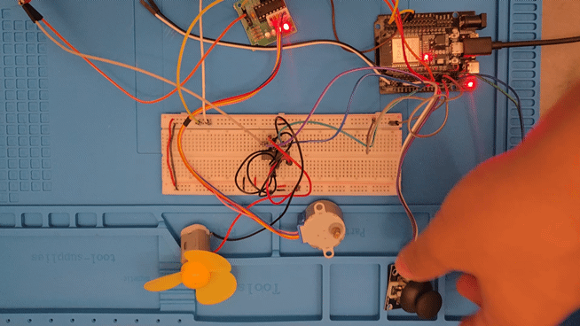
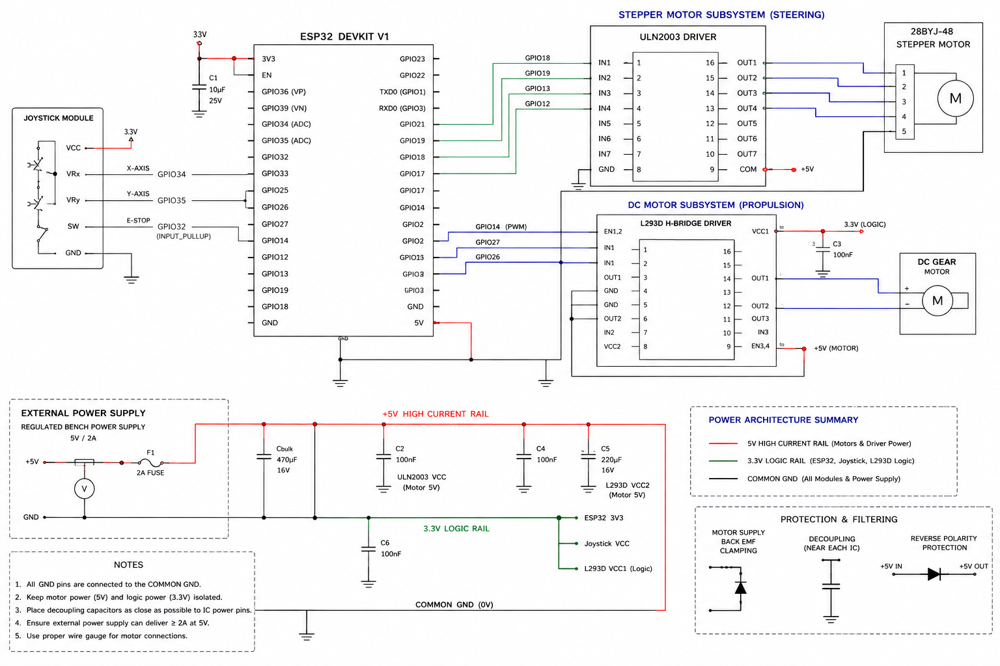
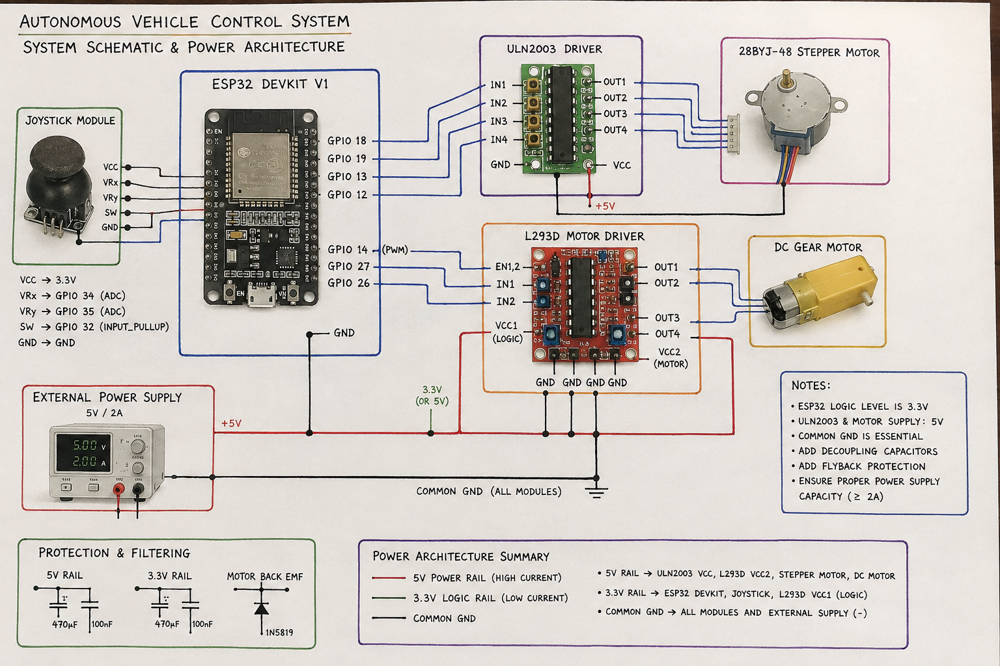
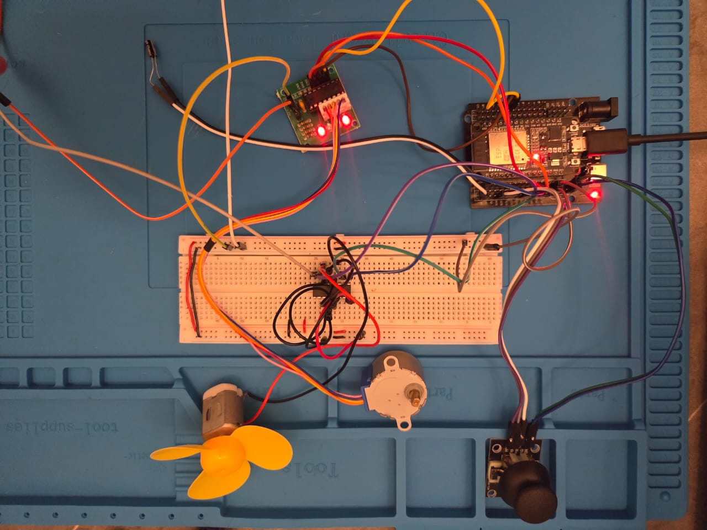

# 🏎️ ESP32 Dual Motor Control with Joystick & Power Optimization

An embedded dual-actuator control system powered by the **ESP32 Dev Module**. The system provides real-time steering and propulsion control using a 2-axis Analog Joystick, featuring a **28BYJ-48 Stepper Motor** (via ULN2003 driver) for precision steering, a **DC Motor** (via L293D H-Bridge) for directional drive, dynamic ADC Deadzone calibration, and dedicated external power isolation to prevent brownout conditions.

## 🎬 Project Demo



---

## 📌 Features

* **Multi-Actuator Dual Driver Setup**: Concurrent control of a Stepper Motor (Steering) using ULN2003 and a DC Motor (Propulsion) using L293D.
* **Calibrated ADC & Dynamic Deadzone Handling**: Custom non-linear thresholding to eliminate analog floating noise and prevent unwanted motor creeping around center offset values (`~1830` X-axis / `~1908` Y-axis).
* **Power Isolation & Brownout Prevention**: Dedicated 5V DC external bench power integration with shared ground reference (`Common GND`) to isolate inductive motor current spikes from logic circuitry.
* **Coil Power Saving Mode**: Automatically de-energizes Stepper Motor coils (`GPIO LOW`) during idle states to reduce thermal generation and power draw.
* **Hardware Emergency Stop**: Integrated tactile switch interrupt for immediate full-actuator shutdown.

---

## 🛠️ Hardware Requirements

| Component | Quantity | Description / Specification |
| :--- | :---: | :--- |
| **ESP32 DevKit V1** | 1 | 32-bit Microcontroller Board |
| **28BYJ-48 Stepper Motor** | 1 | 5V Unipolar Stepper Motor |
| **ULN2003 Driver Board** | 1 | Darlington Transistor Array Module for Stepper Motor |
| **DC Gear Motor** | 1 | 3–6V DC Motor (Propulsion) |
| **L293D H-Bridge IC** | 1 | Quadruple High-Current Half-H Driver IC |
| **2-Axis Joystick Module** | 1 | Dual Analog Potentiometers (VRx/VRy) + Tactile Switch |
| **External Power Supply** | 1 | Regulated 5V / 2A Bench Power Supply |
| **Breadboard & Jumpers** | — | Interconnection Wires & Prototyping Board |

---

## 🔌 Circuit Pinout Connections

### **1. 2-Axis Joystick Module**
* **VCC** $\rightarrow$ ESP32 **`3.3V`** *(Regulated Logic Line)*
* **GND** $\rightarrow$ ESP32 **`GND`**
* **VRx (X-Axis)** $\rightarrow$ ESP32 **`GPIO 34`** *(Analog Input)*
* **VRy (Y-Axis)** $\rightarrow$ ESP32 **`GPIO 35`** *(Analog Input)*
* **SW (Switch)** $\rightarrow$ ESP32 **`GPIO 32`** *(Internal Pull-Up enabled)*

### **2. Stepper Motor Driver (ULN2003)**
* **IN1** $\rightarrow$ ESP32 **`GPIO 18`**
* **IN2** $\rightarrow$ ESP32 **`GPIO 19`**
* **IN3** $\rightarrow$ ESP32 **`GPIO 13`**
* **IN4** $\rightarrow$ ESP32 **`GPIO 12`**
* **VCC (+)** $\rightarrow$ External Power Supply **`+5V`**
* **GND (-)** $\rightarrow$ External Power Supply **`GND`** & ESP32 **`GND`** *(Common Ground)*

### **3. DC Motor Driver (L293D IC)**
* **Pin 1 (Enable 1,2)** $\rightarrow$ ESP32 **`GPIO 14`** *(PWM Speed Control)*
* **Pin 2 (Input 1)** $\rightarrow$ ESP32 **`GPIO 27`**
* **Pin 7 (Input 2)** $\rightarrow$ ESP32 **`GPIO 26`**
* **Pin 3 (Output 1)** $\rightarrow$ DC Motor Terminal A
* **Pin 6 (Output 2)** $\rightarrow$ DC Motor Terminal B
* **Pin 16 (VCC1 Logic)** $\rightarrow$ ESP32 **`3.3V` / `5V`**
* **Pin 8 (VCC2 Motor)** $\rightarrow$ External Power Supply **`+5V`**
* **Pins 4, 5, 12, 13 (GND)** $\rightarrow$ Common **`GND`**

---
 
## 📐 Circuit Diagrams & Setup

| 2D Schematic Diagram | 2D Circuit View | Real Hardware Setup |
| :---: | :---: | :---: |
|  |  |  |

* 📄 Download Bill of Materials: [components.csv](schematics/components.csv)

---

## 📂 Project Structure

```text
ESP32 Joystick Dual Drive Motor Control/
├── .gitignore
├── README.md
├── src/
│   └── main.ino
└── schematics/
    ├── circuit_diagram.png
    ├── circuit_image.png
    ├── circuit_real.jpeg
    ├── components.csv
    └── demo.gif
```
---
 
## 🚀 How to Run & Setup

1. **Hardware Assembly**: Connect all hardware components according to the Circuit Pinout Connections section above. Ensure a **Common Ground (GND)** is shared across the ESP32 and external 5V power supply.
2. **Install Required Libraries**: Open Arduino IDE, navigate to `Tools > Manage Libraries`, search for and install:
* **Stepper** (Built-in Arduino library for motor control)
* **ESP32 Board Package** (via `Tools > Board > Boards Manager`)


3. **Upload Code**:
* Connect your ESP32 board to your computer via USB cable.
* Open `src/main.ino` in Arduino IDE.
* Select **ESP32 Dev Module** under `Tools > Board > ESP32 Arduino`.
* Select your corresponding COM Port under `Tools > Port`.
* Click the **Upload** button (or press `Ctrl + U`).
---

## 💻 Source Code (`src/main.ino`)

C++
```cpp 
#include <Stepper.h>

// Joystick pin mappings
const int pinVRx = 34; // X-axis (DC Motor)
const int pinVRy = 35; // Y-axis (Stepper Motor)
const int pinSW  = 32; // Emergency stop switch

// DC Motor pins (L293D)
const int dcmotor1Pin1 = 27; 
const int dcmotor1Pin2 = 26; 
const int dcenable1Pin = 14; 

// Stepper Motor settings (28BYJ-48)
const int STEPS_PER_REV = 2048; 
Stepper myStepper(STEPS_PER_REV, 18, 13, 19, 12);

void stopAllMotors();

void setup() {
  myStepper.setSpeed(15);

  pinMode(pinSW, INPUT_PULLUP);
  pinMode(dcmotor1Pin1, OUTPUT);
  pinMode(dcmotor1Pin2, OUTPUT);
  pinMode(dcenable1Pin, OUTPUT);
}

void loop() {
  // Emergency stop check
  if (digitalRead(pinSW) == LOW) {
    stopAllMotors();
    return;
  }

  int xVal = analogRead(pinVRx);
  int yVal = analogRead(pinVRy);

  // DC Motor Control (X-Axis)
  if (xVal > 2200) {
    digitalWrite(dcmotor1Pin1, LOW);
    digitalWrite(dcmotor1Pin2, HIGH);
    int speed = map(xVal, 2201, 4095, 50, 255);
    analogWrite(dcenable1Pin, speed);
  } 
  else if (xVal < 1500) {
    digitalWrite(dcmotor1Pin1, HIGH);
    digitalWrite(dcmotor1Pin2, LOW);
    int speed = map(xVal, 1499, 0, 50, 255);
    analogWrite(dcenable1Pin, speed);
  } 
  else {
    analogWrite(dcenable1Pin, 0);
    digitalWrite(dcmotor1Pin1, LOW);
    digitalWrite(dcmotor1Pin2, LOW);    
  }

  // Stepper Motor Control (Y-Axis)
  if (yVal > 2300) {
    myStepper.step(15);
  } 
  else if (yVal < 1600) {
    myStepper.step(-15);
  } 
  else {
    // Cut coil power to prevent overheating when idle
    digitalWrite(18, LOW);
    digitalWrite(13, LOW);
    digitalWrite(19, LOW);
    digitalWrite(12, LOW);
  }
}

void stopAllMotors() {
  analogWrite(dcenable1Pin, 0);
  digitalWrite(dcmotor1Pin1, LOW);
  digitalWrite(dcmotor1Pin2, LOW);

  digitalWrite(18, LOW);
  digitalWrite(13, LOW);
  digitalWrite(19, LOW);
  digitalWrite(12, LOW);
}
```
